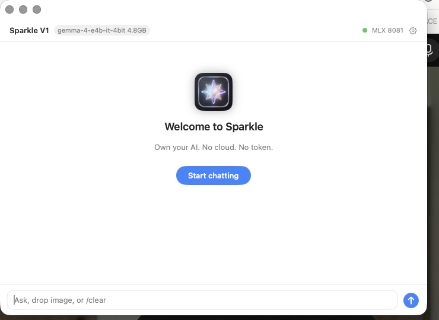

<p align="center">
  
</p>

<h1 align="center">Sparkle</h1>
<p align="center"><sub>powered by <a href="https://github.com/ddalcu/mlx-serve">mlx-serve</a> — 98 Zig files, 20 model types, 8 media backends, 118 tok/s</sub></p>

<p align="center">
  <strong>Own your AI. No cloud. No token.</strong><br>
  Chat, image, and vision on your Mac. Offline. One download. Not a toy wrapper, a native Zig inference engine.
</p>

<p align="center">
  <a href="https://github.com/LNSTT369/Sparkle/releases/latest/download/Sparkle.dmg">
    
  </a>
  <br>
  <sub>Apple Silicon · macOS 14+ · 5GB with gemma-4-e4b-it-4bit inside · No HF token</sub>
</p>

---

### One download

Drag `Sparkle.dmg` to `/Applications`, open, and chat. The 4.8GB `gemma-4-e4b-it-4bit` is already inside `Contents/Resources/models`, no cards, no `Download` wait.

### What it does

* Chat at 79 tok/s, vision at 76 tok/s, image drop inline
* Streaming typewriter, `/clear` to reset, `⌘,` for the other two models hidden in Settings
* Menu bar star, dock star, `stream: true` on `http://127.0.0.1:11234` for Claude Code

### Under the hood — an engine, not a wrapper

* Native Zig `src/*.zig` 98 files at 287k plus Swift `app/Sources` 79k, `build.zig` pins `0.17` nightly and self builds `lib/mlx-src` 0.32.2 plus `mlx-c`, `jinja_cpp`, `stb_image`, `ds4`, `llama.cpp`, ANE. `brew install` alone will not build.
* `20` `model_type` from `gemma4` to `laguna` and `8` media in `src/gen.zig` from Flux to Hunyuan3D. `src/server.zig` is 4000 lines. `benchmarks.md` at 118 tok/s for E4B and 236 tok/s for Qwen3.6 35B on M4 Max is why.
* Engineering discipline: `CLAUDE.md` TDD `zig build test 6/6`, hermetic `format_corpus_test.zig`, `tool_traffic_replay_test.zig`, every bug becomes a rule. That is the cost of beating `llama.cpp`.

### For the curious

```bash
brew tap LNSTT369/Sparkle && brew install --cask sparkle
sparkle run gemma4:e4b  # same 4.8GB, auto pulls if you use the Lite build
```

MIT. Built in Swift + Zig, no Electron, no Python at runtime. See `CLAUDE.md` for the 750 line gotcha list.

<p align="center">
  
  <br>
  <sub>Drop a photo, ask, get an answer. No cloud.</sub>
</p>
